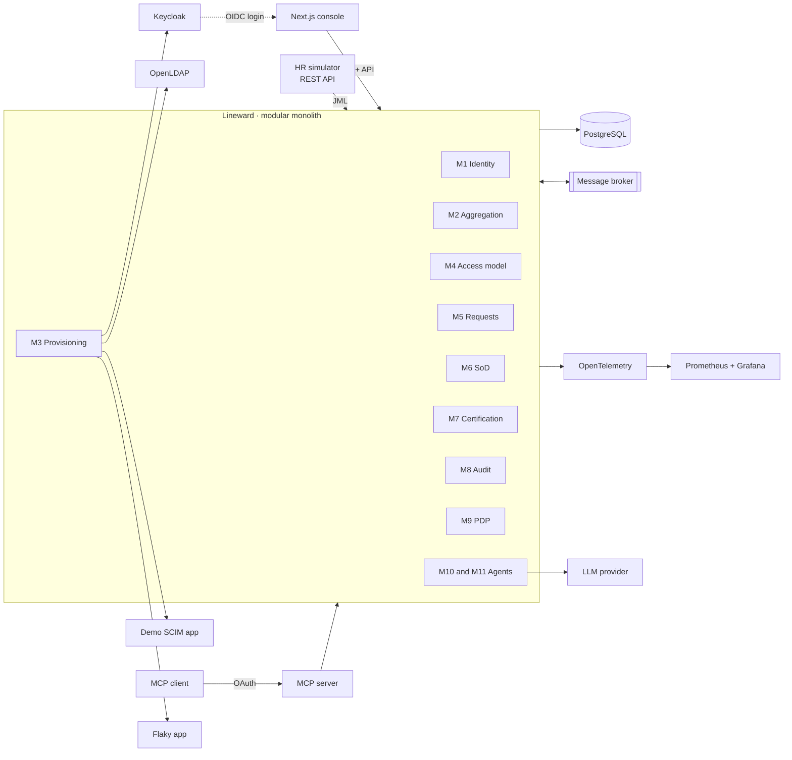

# Lineward

**Open source Identity Governance and Administration (IGA) platform, with governance for AI agents.**

Lineward aggregates accounts from heterogeneous systems, correlates them with identities, provisions access through approval workflows with segregation of duties control, produces audit evidence for recertification campaigns, and extends that same governance to the AI agents acting on people's behalf.

> **Status: work in progress. Phase 0 of 8.**
> There is no runnable code yet. What exists today is the design: the project charter, the architecture and the first architecture decision records. This README will track real progress, not intentions.

---

## The problem

In any organization above a few hundred people, nobody can answer three questions with confidence:

1. **Who has access to what?** Accounts live in dozens of disconnected systems: a directory, an identity provider, a payroll application, a dozen SaaS products.
2. **Why do they have it?** Access accumulates. People change teams and keep the permissions of their previous role, a pattern known as privilege creep. Somebody granted a permission by hand two years ago and nobody remembers why.
3. **Should they still have it?** Accounts outlive the people who owned them. Orphan accounts, the most common audit finding in access control, belong to nobody and often still work.

IGA is the discipline that answers those questions, and it is what regulators ask about first when they audit access control. Lineward implements it end to end.

And it adds the dimension that matters now: AI agents act with credentials, and they bring back every problem IGA already solved for people, multiplied by their speed and autonomy. Agents with shared API keys that never expire. Agents with more permissions than they need. Agents still running after the project that created them ended. No way to tell **on whose behalf** an agent acted.

**Lineward treats AI agents as first class identities, governed exactly like human ones.**

---

## What it does

| Module | Capability | Phase | Status |
|---|---|---|---|
| M1 | Identities and authoritative source, with joiner, mover and leaver lifecycle events | 1 | Planned |
| M2 | Aggregation, correlation and reconciliation, including orphan account and drift detection | 1 | Planned |
| M3 | Connectors and provisioning: Keycloak, LDAP, SCIM 2.0, plus a deliberately unreliable app to prove resilience | 2 | Planned |
| M4 | Access model: entitlements, business roles, access lineage, basic role mining | 3 | Planned |
| M5 | Access requests and configurable approval workflows | 3 | Planned |
| M6 | Segregation of duties, preventive and detective, with exceptions and a conflict simulator | 3 | Planned |
| M7 | Access certification campaigns, including rubber stamping detection | 4 | Planned |
| M8 | Hash chained audit log with an integrity verifier, and compliance reporting | 4 | Planned |
| M9 | Real time authorization: a policy decision point with ABAC policies as code | 5 | Planned |
| M10 | AI agent identity governance: delegation, permission intersection, kill switch | 6 | Planned |
| M11 | AI agents serving IAM: certification copilot, natural language queries, MCP server | 7 | Planned |

---

## The AI angle

Lineward works on both sides of the same problem.

**IAM for AI: governing agents.** An agent is an identity with a lifecycle, a mandatory human sponsor, its own access, its own certification campaigns and its own audit trail. Its tools are modeled as entitlements, so being allowed to call `request_access` is a permission that gets requested, approved and recertified like any other. When an agent acts for a person, delegation is explicit: the token carries the person as subject and the agent as actor, following RFC 8693 token exchange. **Effective permissions are the intersection of both**, so an agent acting for someone can never do something that person could not do. If the sponsor leaves the organization, the agent is suspended automatically. There is a kill switch, per agent and global.

**AI for IAM: agents that help.** Certification campaigns fail in practice because reviewers approve everything without looking, and they do that because they lack context. A copilot that summarizes usage, age, risk, SoD conflicts and comparison with peers in the same role turns a meaningless click into an informed decision. The agent proposes, the human decides. Queries run through typed read only tools, never free SQL, and always with the permissions of whoever is asking.

Every text coming from outside is treated as untrusted data, never as instructions, and the project ships an adversarial eval suite that runs in CI.

---

## Architecture

A modular monolith. Strict internal module boundaries verified by architecture tests, without the operational cost of microservices.

### Standards

The project implements published specifications rather than inventing its own: OAuth 2.x, OpenID Connect, PKCE, SCIM 2.0 (RFC 7643 and RFC 7644), LDAP, Token Exchange (RFC 8693), DPoP (RFC 9449), Rich Authorization Requests (RFC 9396), CIBA and the MCP authorization specification. Compliance capabilities are mapped against DORA, NIS2, ISO/IEC 27001 and the Spanish ENS.

### Stack

Java, Spring Boot, PostgreSQL, Flyway, Keycloak, OpenLDAP, Next.js, Testcontainers, OpenTelemetry, Docker Compose, GitHub Actions.

Exact versions are pending confirmation and will be recorded in ADR-006.

---

## Getting started

Not available yet. The goal for Phase 0 is that `docker compose up` brings up the whole environment with one command. This section will carry the real instructions once it does.

---

## Documentation

- [`docs/PROYECTO.md`](docs/PROYECTO.md): the project charter and single source of truth. Scope, architecture, threat model, roadmap and progress log.
- [`docs/adr/`](docs/adr/): architecture decision records, one file per decision.

Working documentation is written in Spanish, which is deliberate and recorded in [ADR-002](docs/adr/0002-idiomas.md). Code, APIs and public facing material are in English.

---

## Roadmap

| Phase | Scope | Status |
|---|---|---|
| 0 | Foundations: repository, ADRs, domain model, skeleton, CI | In progress |
| 1 | Identities and aggregation | Planned |
| 2 | Connectors and provisioning | Planned |
| 3 | Access model, requests and segregation of duties | Planned |
| 4 | Certification and audit | Planned |
| 5 | Real time authorization | Planned |
| 6 | AI agent governance | Planned |
| 7 | AI agents serving IAM, and the MCP server | Planned |
| 8 | Hardening, performance and public demo | Planned |

---

## About this project

Lineward is a personal learning and portfolio project built by Ayyoub Amjahed Abed. It is **not affiliated with, endorsed by or derived from any employer or client**, and it is designed entirely from public standards, open product documentation and industry literature.

All data in the project is **synthetic**, generated reproducibly from a fixed seed. No real personal data is used anywhere, and none should be.

## License

Licensed under the [Apache License 2.0](LICENSE). See [ADR-008](docs/adr/0008-licencia.md) for why.

## Author

Ayyoub Amjahed Abed, [ayyoub.dev](https://ayyoub.dev)
